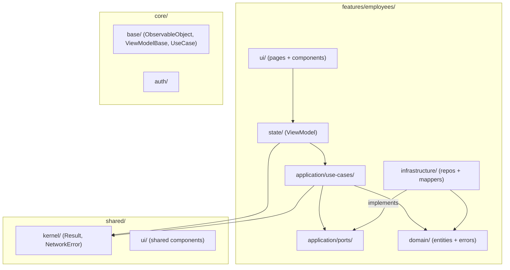

# Enterprise Angular Architecture Guide

## 1. Introduction

This guide is the authoritative architecture reference for this workspace's Angular app — **Runway** (`apps/runway`). It combines **Feature-Centric Clean Architecture**, **MVVM**, **Railway-Oriented Programming (ROP)**, and **Test-Driven Development (TDD)** to produce code that is maintainable, testable, and scalable without the ceremony of layer-first global structures.

> **Workspace paths.** This repo is a pnpm monorepo; the Angular app root is `apps/runway/`. Where this guide writes `src/app/…`, read it as `apps/runway/src/app/…`. The foundation is owned here: `apps/runway/src/app/shared/kernel/result.ts` and `apps/runway/src/app/core/base/{observable-object,view-model.base,use-case.base}.ts`.

### Core philosophy

- **Feature cohesion over layer purity**: code that changes together lives together. Each feature owns its full stack.
- **SOLID + Dependency Rule**: dependencies point inward. Infrastructure implements Application ports, never the other way around.
- **Typed errors, never thrown domain failures**: use `Result<T, E>` for business errors; let infrastructure exceptions propagate for transport failures.
- **Test-first discipline**: failing test before implementation, every time.
- **Signal-based state**: Angular Signals replace Redux/NGRX for local and feature state.

---

## 2. Architecture Overview

### Why Feature-Centric?

Traditional "layer-first" architectures (`core/domain/`, `core/application/`…) scatter a single feature's code across 5+ directories. Every change requires navigating the whole tree. Feature-Centric Architecture co-locates everything for one feature while maintaining Clean Architecture boundaries *within* each feature slice.



### Folder structure

```
src/app/
  features/
    <feature-name>/
      domain/
        <name>.entity.ts          ← rich entity, enforces invariants, no Angular
        errors/
          <name>.errors.ts        ← discriminated union with kind + message
      application/
        ports/
          i-<name>.repository.ts  ← interface + InjectionToken
        use-cases/
          <action>-<name>.use-case.ts
      infrastructure/
        http/
          <name>.dto.ts
        mappers/
          <name>.mapper.ts
        repositories/
          http-<name>.repository.ts
      state/
        <name>.view-model.ts
      ui/
        pages/
          <name>-page.component.ts
        components/
          <name>.component.ts
      index.ts                    ← public API: export only what callers need
  shared/
    kernel/
      result.ts                   ← Result<T,E>, ok, fail, isOk, match, NetworkError
    ui/                           ← shared presentational components
  core/
    base/
      observable-object.ts
      view-model.base.ts
      use-case.base.ts
    auth/
    guards/
    interceptors/
```

### Dependency rule

```
Presentation → State/MVVM → Application → Domain
                                  ↑
                          Infrastructure (implements ports)
```

Domain and Application layers must never import Angular, `HttpClient`, or UI code.

---

## 3. Domain Layer

The Domain layer holds the truth about the business. It is pure TypeScript — no Angular, no HTTP.

### Rich domain models

Avoid anemic models (plain data bags). Rich models enforce invariants and own their state transitions.

**Anemic (bad):**

```typescript
export interface Employee {
  id: string;
  status: 'active' | 'inactive';
  // logic scattered across services
}
```

**Rich (good):**

```typescript
export class Employee {
  private _status: EmployeeStatus;

  constructor(private readonly props: EmployeeProps) {
    this._status = props.status;
  }

  get id(): string { return this.props.id; }
  get status(): EmployeeStatus { return this._status; }

  deactivate(): void {
    if (this._status === 'inactive') {
      throw new DomainError('Employee is already inactive');
    }
    this._status = 'inactive';
  }
}
```

### Domain error types

Domain errors are discriminated unions with `kind` (for branching) and `message` (for banner display). Never use `Error` subclasses for domain failures.

```typescript
export type CreateEmployeeError =
  | { readonly kind: 'DuplicateEmployee'; readonly existingId: string; readonly message: string }
  | { readonly kind: 'InvalidRequest';    readonly reason: string;     readonly message: string };

export type DeactivateEmployeeError =
  | { readonly kind: 'EmployeeNotFound';  readonly id: string;         readonly message: string }
  | { readonly kind: 'AlreadyInactive';   readonly message: string };
```

Rules:
- Always use `kind` as the discriminant — never `type`, `code`, or `name`
- Always include `readonly message: string` — consumed by `ViewModelBase` for generic banner display
- `NetworkError` must never appear in domain error unions — it is a transport concern

---

## 4. Railway-Oriented Programming (ROP)

### The problem with thrown exceptions for domain failures

Throwing domain errors creates implicit control flow. Callers forget to catch. TypeScript gives no compile-time guarantee that a failure case is handled. Tests become fragile.

### The Result type

`Result<T, E>` makes every failure mode visible and typed.

```typescript
// src/app/shared/kernel/result.ts

// Railway-oriented return type for use cases that can fail with business errors.
// `ok` variant carries the value; `fail` variant carries a typed domain error.
// Transport-level failures (network, 5xx) stay as thrown exceptions and are
// caught by ViewModelBase.executeWithResult, which lifts them into the union
// via NetworkError. Domain error unions therefore do NOT include 'Network'.
export type Result<T, E> =
  | { readonly ok: true;  readonly value: T }
  | { readonly ok: false; readonly error: E };

export const ok   = <T>(value: T): Result<T, never> => ({ ok: true, value });
export const fail = <E>(error: E): Result<never, E> => ({ ok: false, error });
export const isOk = <T, E>(r: Result<T, E>): r is { ok: true; value: T } => r.ok;

export const match = <T, E, U>(
  r: Result<T, E>,
  onOk: (value: T) => U,
  onFail: (error: E) => U
): U => r.ok ? onOk(r.value) : onFail(r.error);

// Transport-level failure variant added by ViewModelBase.executeWithResult when
// the use case throws (e.g. fetch failure, 5xx without a recognised body).
// Domain unions stay focused on business errors; the wrapper folds in this kind.
export interface NetworkError {
  readonly kind: 'Network';
  readonly message: string;
}
```

### When to use `Result<T, E>` vs `Promise<T>`

| Situation | Return type |
|-----------|-------------|
| Failure is always infrastructure (network, 5xx) — no business decision needed | `Promise<T>` — let it throw |
| Failure is a business case the caller must decide on | `Promise<Result<T, E>>` |

```typescript
export interface IEmployeeRepository {
  // Infrastructure failure only — throws on network error
  getEmployees(): Promise<Employee[]>;
  // Business failure — duplicate, invalid request
  createEmployee(req: CreateEmployeeRequest): Promise<Result<Employee, CreateEmployeeError>>;
  // Business failure — not found, already inactive
  deactivateEmployee(id: string): Promise<Result<void, DeactivateEmployeeError>>;
}
```

### The `NetworkError` boundary

`ViewModelBase.executeWithResult` catches any thrown exception from a use case and wraps it in `NetworkError`. The ViewModel receives a `Result<T, E | NetworkError>` — always a Result, never an undefined-on-throw surprise.

```typescript
protected async executeWithResult<T, E extends { message: string }>(
  operation: () => Promise<Result<T, E>>,
): Promise<Result<T, E | NetworkError>> {
  this.setProperty(this._isLoading, true);
  this.setProperty(this._error, null);
  try {
    const result = await operation();
    if (!result.ok) this.setProperty(this._error, result.error.message);
    return result;
  } catch (err: unknown) {
    const raw = err as { error?: { message?: string }; message?: string };
    const message = raw?.error?.message ?? raw?.message ?? 'Network error';
    this.setProperty(this._error, message);
    return fail<NetworkError>({ kind: 'Network', message });
  } finally {
    this.setProperty(this._isLoading, false);
  }
}
```

---

## 5. Application Layer: The Use Case Pattern

A Use Case is a single business action. It replaces "god services" that accumulate dozens of unrelated methods.

### Use case interface

```typescript
// src/app/core/base/use-case.base.ts
export interface UseCase<TParam, TResult> {
  execute(param: TParam): Promise<TResult>;
}
```

### Infallible use case

```typescript
@Injectable({ providedIn: 'root' })
export class GetEmployeesUseCase implements UseCase<void, Employee[]> {
  private readonly repo = inject(EMPLOYEE_REPOSITORY);
  execute(): Promise<Employee[]> {
    return this.repo.getEmployees();
  }
}
```

### Fallible use case (ROP)

```typescript
@Injectable({ providedIn: 'root' })
export class CreateEmployeeUseCase
  implements UseCase<CreateEmployeeRequest, Result<Employee, CreateEmployeeError>> {

  private readonly repo = inject(EMPLOYEE_REPOSITORY);

  execute(req: CreateEmployeeRequest): Promise<Result<Employee, CreateEmployeeError>> {
    return this.repo.createEmployee(req);
  }
}
```

Benefits over god services: each use case has one reason to change; ViewModels inject only what they need; unit tests are simple; use cases compose cleanly.

---

## 6. State Management Layer (MVVM)

### `ObservableObject`

Enforces that signal mutation only happens through a protected gateway.

```typescript
// src/app/core/base/observable-object.ts
export abstract class ObservableObject {
  protected setProperty<T>(signal: WritableSignal<T>, value: T): void {
    signal.set(value);
  }

  protected updateProperty<T>(signal: WritableSignal<T>, updater: (v: T) => T): void {
    signal.update(updater);
  }

  protected batchUpdate(updates: () => void): void {
    untracked(updates);
  }
}
```

### `ViewModelBase`

```typescript
// src/app/core/base/view-model.base.ts
@Injectable()
export abstract class ViewModelBase extends ObservableObject {
  private readonly _isLoading = signal(false);
  private readonly _error     = signal<string | null>(null);

  readonly isLoading = this._isLoading.asReadonly(); // for spinner
  readonly error     = this._error.asReadonly();     // for generic banner — display only

  protected async executeWithResult<T, E extends { message: string }>(
    operation: () => Promise<Result<T, E>>,
  ): Promise<Result<T, E | NetworkError>> {
    this.setProperty(this._isLoading, true);
    this.setProperty(this._error, null);
    try {
      const result = await operation();
      if (!result.ok) this.setProperty(this._error, result.error.message);
      return result;
    } catch (err: unknown) {
      const raw = err as { error?: { message?: string }; message?: string };
      const message = raw?.error?.message ?? raw?.message ?? 'Network error';
      this.setProperty(this._error, message);
      return fail<NetworkError>({ kind: 'Network', message });
    } finally {
      this.setProperty(this._isLoading, false);
    }
  }
}
```

### Concrete ViewModel

```typescript
@Injectable()
export class EmployeeViewModel extends ViewModelBase {
  private readonly getUseCase    = inject(GetEmployeesUseCase);
  private readonly createUseCase = inject(CreateEmployeeUseCase);

  // Infallible list load
  private readonly _employees = signal<Employee[]>([]);
  readonly employees = this._employees.asReadonly();

  // Typed error signal for the create flow
  readonly createError = signal<CreateEmployeeError | NetworkError | null>(null);

  async loadEmployees(): Promise<void> {
    const result = await this.executeWithResult<Employee[], never>(
      () => this.getUseCase.execute()
    );
    if (isOk(result)) this.setProperty(this._employees, result.value);
  }

  async createEmployee(req: CreateEmployeeRequest): Promise<void> {
    this.createError.set(null);
    const result = await this.executeWithResult(() => this.createUseCase.execute(req));
    match(result,
      emp  => this.updateProperty(this._employees, list => [...list, emp]),
      err  => this.createError.set(err)
    );
  }
}
```

**ViewModel rules:**
- Private `WritableSignal<T>`, expose via `.asReadonly()`
- The base `error` signal is for generic banner display **only** — never parse it for branching
- Typed error signals per action for specific error handling
- Inject Use Cases only — no repositories, no HttpClient, no Router
- No business logic — orchestration only

---

## 7. Infrastructure Layer

### Repository implementation

```typescript
@Injectable({ providedIn: 'root' })
export class HttpEmployeeRepository implements IEmployeeRepository {
  private readonly http = inject(HttpClient);

  getEmployees(): Promise<Employee[]> {
    return firstValueFrom(
      this.http.get<EmployeeDto[]>('/api/employees').pipe(
        map(dtos => dtos.map(EmployeeMapper.toDomain))
      )
    );
  }

  async createEmployee(req: CreateEmployeeRequest): Promise<Result<Employee, CreateEmployeeError>> {
    try {
      const dto = await firstValueFrom(this.http.post<EmployeeDto>('/api/employees', req));
      return ok(EmployeeMapper.toDomain(dto));
    } catch (err: unknown) {
      // HTTP 409 → known domain error
      if ((err as HttpErrorResponse).status === 409) {
        return fail({ kind: 'DuplicateEmployee', existingId: req.id, message: 'Employee already exists' });
      }
      throw err; // Unknown errors propagate; ViewModelBase catches them as NetworkError
    }
  }
}
```

### Mappers

Always map between DTO (API shape) and Domain (business shape). API changes never leak into the core.

```typescript
export class EmployeeMapper {
  static toDomain(dto: EmployeeDto): Employee {
    return new Employee({ id: dto.id, name: dto.full_name, status: dto.is_active ? 'active' : 'inactive' });
  }

  static toDto(emp: Employee): Partial<EmployeeDto> {
    return { id: emp.id };
  }
}
```

---

## 8. Presentation Layer

### Smart page (container)

```typescript
@Component({
  selector: 'app-employees-page',
  imports: [EmployeeListComponent, EmployeeCreateFormComponent],
  template: `
    @if (vm.isLoading()) {
      <app-spinner />
    }
    @if (vm.error()) {
      <app-banner [message]="vm.error()!" />
    }
    <app-employee-list [employees]="vm.employees()" />
    <app-employee-create-form (submitted)="vm.createEmployee($event)" />
    @if (vm.createError(); as err) {
      @switch (err.kind) {
        @case ('DuplicateEmployee') { <p>Employee {{err.existingId}} already exists.</p> }
        @case ('InvalidRequest')    { <p>Invalid: {{err.reason}}</p> }
        @case ('Network')           { <p>Network error: {{err.message}}</p> }
      }
    }
  `,
  providers: [EmployeeViewModel]
})
export class EmployeesPageComponent {
  readonly vm = inject(EmployeeViewModel);
}
```

### Dumb component

```typescript
@Component({
  selector: 'app-employee-card',
  template: `<div>{{ employee().name }}</div>`,
})
export class EmployeeCardComponent {
  readonly employee = input.required<Employee>();
  readonly deactivate = output<string>();
}
```

**Mandatory for all components:**
- No explicit `standalone: true` (v20+ default)
- No explicit `ChangeDetectionStrategy.OnPush` (v22+ default)
- `input()` / `output()` — not `@Input()` / `@Output()`
- `host` object — not `@HostBinding` / `@HostListener`
- `inject()` — not constructor injection

---

## 9. Testing Strategy

### Principle: Red → Green → Refactor

Write the failing test first. Confirm it fails. Implement the minimum to make it pass. Refactor with the safety net. Repeat.

For AI-assisted development: always provide the failing test before asking for an implementation. This bounds the change, makes success criteria unambiguous, and prevents comprehension debt.

### Tools

| Layer | Tool | Why |
|-------|------|-----|
| Domain, Use Cases, ViewModels | Vitest | Fast, no Angular TestBed needed for pure logic |
| Components | Vitest + `@testing-library/angular` | Test user-facing behavior, not implementation details |
| E2E | Playwright | Full feature flows in a real browser |

### Interpreters over mocks at the repository boundary

A **mock** short-circuits code traversal: `vi.fn().mockResolvedValue(employee)` — the use case's error-handling logic is never exercised.

An **interpreter** (in-memory implementation) traverses real code: `InMemoryEmployeeRepository.createEmployee` enforces constraint checks and returns the appropriate `Result`.

Use interpreters for repository ports. Use simple stubs only for use-case boundaries when testing ViewModels.

### Domain layer — zero mocks

```typescript
describe('Employee', () => {
  it('throws DomainError when deactivating an already-inactive employee', () => {
    const emp = new Employee({ id: '1', name: 'Alice', status: 'inactive' });
    expect(() => emp.deactivate()).toThrow(DomainError);
  });

  it('transitions to inactive when deactivating an active employee', () => {
    const emp = new Employee({ id: '1', name: 'Alice', status: 'active' });
    emp.deactivate();
    expect(emp.status).toBe('inactive');
  });
});
```

### Use case layer — in-memory interpreter

```typescript
class InMemoryEmployeeRepository implements IEmployeeRepository {
  private employees: Employee[];
  constructor(seed: Employee[] = []) { this.employees = [...seed]; }

  getEmployees(): Promise<Employee[]> { return Promise.resolve(this.employees); }

  createEmployee(req: CreateEmployeeRequest): Promise<Result<Employee, CreateEmployeeError>> {
    const duplicate = this.employees.find(e => e.id === req.id);
    if (duplicate) return Promise.resolve(
      fail({ kind: 'DuplicateEmployee', existingId: duplicate.id, message: 'Already exists' })
    );
    const emp = new Employee({ ...req, status: 'active' });
    this.employees.push(emp);
    return Promise.resolve(ok(emp));
  }

  deactivateEmployee(id: string): Promise<Result<void, DeactivateEmployeeError>> {
    const emp = this.employees.find(e => e.id === id);
    if (!emp) return Promise.resolve(
      fail({ kind: 'EmployeeNotFound', id, message: 'Not found' })
    );
    emp.deactivate(); // throws DomainError if already inactive → propagates as NetworkError in VM tests
    return Promise.resolve(ok(undefined as void));
  }
}

describe('CreateEmployeeUseCase', () => {
  it('returns DuplicateEmployee when employee already exists', async () => {
    const existing = new Employee({ id: '1', name: 'Alice', status: 'active' });
    TestBed.configureTestingModule({
      providers: [
        CreateEmployeeUseCase,
        { provide: EMPLOYEE_REPOSITORY, useValue: new InMemoryEmployeeRepository([existing]) }
      ]
    });
    const useCase = TestBed.inject(CreateEmployeeUseCase);
    const result = await useCase.execute({ id: '1', name: 'Bob' });
    expect(isOk(result)).toBe(false);
    if (!isOk(result)) expect(result.error.kind).toBe('DuplicateEmployee');
  });
});
```

### ViewModel layer — stubs

```typescript
describe('EmployeeViewModel', () => {
  it('sets createError signal on DuplicateEmployee', async () => {
    const stubUseCase = {
      execute: vi.fn().mockResolvedValue(
        fail({ kind: 'DuplicateEmployee', existingId: '1', message: 'Already exists' })
      )
    };
    TestBed.configureTestingModule({
      providers: [
        EmployeeViewModel,
        GetEmployeesUseCase,
        { provide: CreateEmployeeUseCase, useValue: stubUseCase },
        { provide: EMPLOYEE_REPOSITORY, useValue: new InMemoryEmployeeRepository() }
      ]
    });
    const vm = TestBed.inject(EmployeeViewModel);
    await vm.createEmployee({ id: '1', name: 'Alice' });
    expect(vm.createError()?.kind).toBe('DuplicateEmployee');
    expect(vm.isLoading()).toBe(false);
  });
});
```

### Component layer — `@testing-library/angular`

Test user-facing behavior: render, interact, assert on DOM. Never assert on internal component state.

### E2E — Playwright

Cover the happy path and critical failure modes. Do not re-test what unit tests already cover.

```typescript
// e2e/employees.spec.ts
test('shows duplicate error when creating an existing employee', async ({ page }) => {
  await page.goto('/employees');
  await page.fill('[data-testid="employee-name"]', 'Alice');
  await page.click('[data-testid="create-btn"]');
  await expect(page.locator('[data-testid="duplicate-error"]')).toBeVisible();
});
```

---

## 10. Path Aliases and Configuration

`tsconfig.json` — `compilerOptions.paths`:

```json
{
  "compilerOptions": {
    "paths": {
      "@features/*": ["src/app/features/*"],
      "@shared/*":   ["src/app/shared/*"],
      "@core/*":     ["src/app/core/*"]
    }
  }
}
```

Import through barrel `index.ts`. Use `./` only for same-directory imports.

```typescript
// ✅ feature public API
import { Employee } from '@features/employees';
// ✅ shared kernel
import { ok, fail, Result } from '@shared/kernel/result';
// ✅ core base
import { ViewModelBase } from '@core/base/view-model.base';
// ❌ internal feature detail — never import this from outside the feature
import { HttpEmployeeRepository } from '@features/employees/infrastructure/repositories/http-employee.repository';
```

---

## 11. Conclusion

This architecture provides four guarantees:

- **Maintainability**: every feature is a self-contained slice; changes are local
- **Scalability**: new features add new slices without modifying existing ones
- **Testability**: every layer is independently testable with the right test double strategy
- **Type safety**: domain errors are typed and exhaustive; no silent failure modes

The layering within each slice mirrors Clean Architecture, but the feature boundary is the primary unit of cohesion. Shared concepts live in `shared/kernel/` — kept deliberately minimal to avoid recreating a god domain layer.
